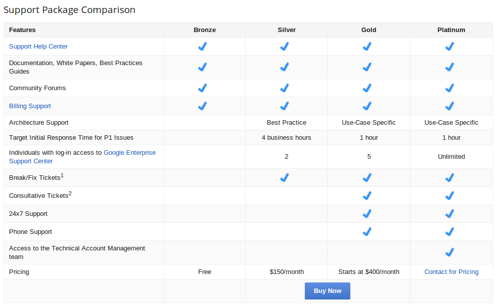

title: War Stories with Google App Engine And Go
author:
  name: Mark Mandel
  twitter: Neurotic
  email: mark@compoundtheory.com
  url: http://www.compoundtheory.com
style: style.css
--
# War Stories with Google App Engine And Go
--
# GO + GAE IS EXPERIMENTAL
## Don't forget this!
--
### Support 


--
### Google Appengine Go Google Group
[https://groups.google.com/forum/#!forum/google-appengine-go](https://groups.google.com/forum/#!forum/google-appengine-go)
--
### Go Workspace
```bash
source ./env.sh
```

```bash
PWD=`pwd`
APPENGINE=$PWD/go_appengine
VENDOR=$PWD/.vendor

export GOROOT=$APPENGINE/goroot
export GOPATH=$VENDOR:$PWD
export PATH=$APPENGINE:$PWD/bin:$VENDOR/bin:$PATH

```
--
### Package Management
- Used a Forked Version of GPM ([https://github.com/markmandel/gpm](https://github.com/markmandel/gpm))

```bash
deps:
	gpm install -g "$(CURDIR)/$(APPENGINE)/goapp" -u 0
	# build binaries as necessary.
	goapp install github.com/smartystreets/goconvey
	goapp install github.com/clipperhouse/gen

```

```bash
clean-deps:
	rm -rf $(VENDOR_GOPATH)
	mkdir $(VENDOR_GOPATH)
	rm -rf pkg
```
--
# Datastore
## IT'S EVENTUALLY CONSISTENT
--
### Bulk Download/Upload

- Enable the Remote API
- Local is eventually consistent too 
- For big data changes, restart local dev to make sure all data is there
- Batch of ~ 50 for large upload/downloads, both local and remote.

```bash
download-local-data:
	mkdir -p ./data
    appcfg.py download_data --url=$(LOCAL_REMOTE) --filename=./data/foo.data --kind=Foo --batch_size=50
```

```bash
upload-prod-data:
	appcfg.py upload_data --url=$(PROD_REMOTE) --filename=./data/foo.data --kind=Foo --batch_size=50
```
--
# The Context
```go
func MyHandler(w http.ResponseWriter, r *http.Request) {
   ctx := appengine.NewContext(r)
   //do other things
}
```
--
### AETest - AppEngine Test Package

- Can't test:
  - Login/Logout (?)
  - TaskQueue
- Alternative: [https://github.com/mzimmerman/appenginetesting](https://github.com/mzimmerman/appenginetesting)
--
### Convey - BDD Style Testing
- Has a `-gobin` option
- Nice browser display
- Integrated coverage report
- Works with `goapp test`
--
### Convey - BDD Style Testing

```go
func TestPutFoo(t *testing.T) {
	ctx := test.CreateContext()
	defer ctx.Close()

	Convey("When you have a Foo", t, func() {
		f := NewFoo()
		So(f.Name, ShouldEqual, "Bar")

		Convey("you can store it", func() {
			key, err := PutFoo(ctx, &f)
			So(err, ShouldBeNil)

			Convey("and retrieved it", func() {
				reget := &Foo{Id: f.Id}
				err := datastore.Get(ctx, key, reget)

				So(err, ShouldBeNil)
				So(reget, ShouldResemble, &f)
			})
		})
	})
}

```

--
### Unit Tests + Eventual Consistency
Only works in local development
```go
record := Bar{"foo"}
key, err := datastore.Put(ctx, key, &record)
datastore.Get(ctx, key, &Bar{})
```
--
### Tests in Parrallel

```go
func CreateContext() aetest.Context {
	opts := aetest.Options{AppID: fmt.Sprintf("unit-test-%v", os.Getpid())}
	ctx, err := aetest.NewContext(&opts)

	if err != nil {
		panic(err.Error())
	}

	return ctx
}
```
--
### Testing HTTP Routes

Production:
```go
ctx := appengine.NewContext(r)
```

Test:
```go
ctx := aetest.NewContext(nil)
```

--
### Testing HTTP Routes
```go
func MyHandler(w http.ResponseWriter, r *http.Request) {
   ctx := appengine.NewContext(r)
   //do other things
}

func TestHandlet(t *testingT) {
   res := httptest.NewRecorder()
   req := http.NewRequest("GET", "/", nil)
   
   MyHandler(res, req)    
}
```

** PANIC!!! **
appengine: NewContext passed an unknown http.Request in api_dev.go

---
### Testing HTTP Routes
Make all Handlers accept an `appengine.Context`

```go
func MyHandler(ctx appengine.Context, w http.ResponseWriter, r *http.Request) {
   //do things
}
```

```go
func (f ContextHandler) ServeHTTP(w http.ResponseWriter, r *http.Request) {
    c := appengine.NewContext(r)
    f.Real(c, w, r)
}
```

```go
func ContextHanderToHttpHandler(f ContextHandlerFunc) HandlerFunc {
	return func(w http.ResponseWriter, r *http.Request) {
		ctx := appengine.NewContext(r)
		f(ctx, w, r)
	}
}
```
[http://www.compoundtheory.com/testing-go-http-handlers-in-google-app-engine-with-mux-and-higher-order-functions/](http://www.compoundtheory.com/testing-go-http-handlers-in-google-app-engine-with-mux-and-higher-order-functions/)

--
### Controlling Variance
```go
func myHandler(w http.ResponseWriter, r *http.Request) {
    c := appengine.NewContext(r)
    // ...
    // regular request handling
    // ...

    // Save to memcache, but only wait up to 3ms.
    done := make(chan bool, 1) // NB: buffered
    go func() {
        memcache.Set(c, &memcache.Item{
            Key:   key,
            Value: data,
        })
        done <- true
    }()
    select {
    case <-done:
    case <-time.After(3 * time.Millisecond):
    }
}
```

High Performance Apps with Go on App Engine 
[http://www.youtube.com/watch?v=fc25ihfXhbg](http://www.youtube.com/watch?v=fc25ihfXhbg)
--
### Memecache All The Things
#### Goon
An autocaching interface to the app engine datastore for Go. Designed to be similar to the python NDB package.<br/>
[https://github.com/mjibson/goon](https://github.com/mjibson/goon)

--
### Editing Existing Data
#### Do it this way or you will hate life itself


```go
func migrate(w http.ResponseWriter, r *http.Request) {
	ctx := appengine.NewContext(r)

	q := datastore.NewQuery("Foo")
	cursor, err := q.Run(ctx).Cursor()

	f := delay.Func("process", process)
	f.Call(ctx, cursor.String())
}
```
---
```go
func process(ctx appengine.Context, c string) error {
	g := goon.FromContext(ctx)
	q := datastore.NewQuery("Foo")
	cursor, err := datastore.DecodeCursor(c)
	keepGoing := true
    iter := g.Run(q.Start(cursor))
	batch := []Foo{}

	for i := 0; i < BATCH_SIZE; i++ {
		z := Foo{}

		if _, err := iter.Next(&z); err != nil {
			if err == datastore.Done {
				keepGoing = false;  break
			}
		}

        z.Name == "John"
        batch = append(batch, z)
	}

    g.PutMulti(batch)

	if keepGoing {
		f := delay.Func("process", process)
		f.Call(ctx, iter.Cursor().String())
	} 

	return nil
}
```
-- 
### Learn More
- [https://github.com/markmandel/go-gae-war-stories](https://github.com/markmandel/go-gae-war-stories)
- https://developers.google.com/appengine/docs/go/
- \#appengine on Freenode
